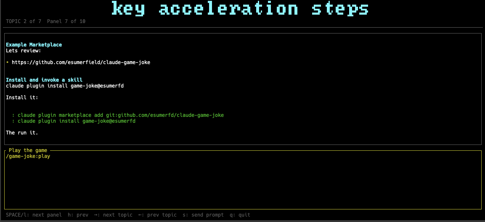

# Present



A Rust TUI presentation app. Loads structured asset directories as topics and panels, rendered in the terminal.

## Install

Requires Rust. Install via [rustup](https://rustup.rs):

```bash
curl --proto '=https' --tlsv1.2 -sSf https://sh.rustup.rs | sh
```

Build the app:

```bash
make build
```

## Running a Presentation

Pass the path to your assets directory:

```bash
cargo run --manifest-path app/Cargo.toml -- --assets-dir /path/to/assets
```

## Asset Directory Structure

```
assets/
  01-topic-name/        # Topics load in numeric order
    01/                 # Panels load in numeric order within a topic
      text.md
    02/
      prompt.md
    03/
      diagram.md
  02-another-topic/
    ...
```

Each panel directory (`01`, `02`, …) may contain one or more asset files. A panel can mix types — e.g. a `text.md` and a `prompt.md` together.

## Asset Types

### `text.md` — Display content

Markdown rendered in the panel. Use for talking points, explanations, or any content you want visible on screen.

```markdown
# Section Title

Key point one.
Key point two.
```

The first heading becomes the panel label.

### `prompt.md` — Claude prompt

A prompt ready to fire at Claude during the presentation. Displayed in the lower portion of the screen. Press `s` to stage it — a countdown starts, giving you time to switch to Claude — then the prompt is automatically typed into an iTerm2 session via AppleScript. If iTerm2 is not available it falls back to copying the prompt to the clipboard for manual paste (`⌘V`).

The first heading becomes the label shown in the UI; everything after it is the prompt text sent to Claude.

```markdown
# Prompt label shown in UI

Actual prompt text sent to Claude.
Ask it something specific here.
```

### `diagram.md` — Mermaid diagram

A Mermaid diagram rendered visually in the panel.

```markdown
graph TD
    A[Start] --> B[Process]
    B --> C[End]
```

## Navigation

| Key | Action |
|-----|--------|
| `l` / `h` | Next / previous panel |
| `j` / `k` | Next / previous topic |
| `s` | Stage prompt send — starts countdown, then auto-types into iTerm2 or copies to clipboard |
| `q` | Quit |
